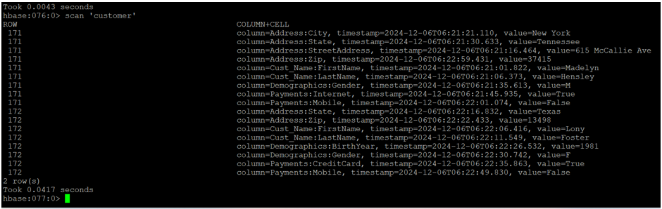

# 🧾 HBase Shell Command Project – Customer Data Modeling

This project uses **Apache HBase shell commands** to create, populate, and query a semi-structured customer database.  
It showcases NoSQL table design with column families for names, addresses, demographics, and payment behavior — using HBase's native shell interface.

---

## 🧱 Table Structure: `customer`

| Column Families   | Example Columns                               |
|-------------------|-----------------------------------------------|
| `Cust_Name`       | FirstName, LastName                           |
| `Address`         | Street, City, State, Zip                      |
| `Demographics`    | DOB, Gender                                   |
| `Payments`        | CreditCard, InternetBanking, MobileBanking    |

---

## 📁 Files Included

- `tutorial_a_shell_commands.txt` – Create table, list, describe, disable, drop  
- `tutorial_a_put_commands.txt` – Inserted customer records using `put`  
- `tutorial_a_scan_commands.txt` – `scan` and filtered scan commands  
- `tutorial_b_shell_commands.txt` – Extended HBase commands and record ops  
- `tutorial_b_customer_puts.txt` – Full customer table population using HBase

---

## 🧠 What This Project Demonstrates

- Designing column families based on logical data domains  
- Using **HBase versioning** for multi-version storage  
- Writing clean `put`, `scan`, and `delete` operations  
- Modeling customer profiles with scalable, semi-structured data  
- Terminal-based interaction with a NoSQL system (HBase shell)  

---

## 📄 Sample Input

```bash
put 'customer', '181', 'Cust_Name:FirstName', 'Madelyn'
put 'customer', '181', 'Address:City', 'New York'
put 'customer', '181', 'Payments:MobileBanking', 'FALSE'

---

## 📄 Sample Output

hbase(main):001:0> scan 'customer'
ROW COLUMN+CELL
 181 column=Cust_Name:FirstName, timestamp=..., value=Madelyn
 181 column=Address:City, timestamp=..., value=New York
 181 column=Payments:MobileBanking, timestamp=..., value=FALSE

---

## 🖼️ Preview



> *Terminal output showing HBase scan results after inserting customer records.


